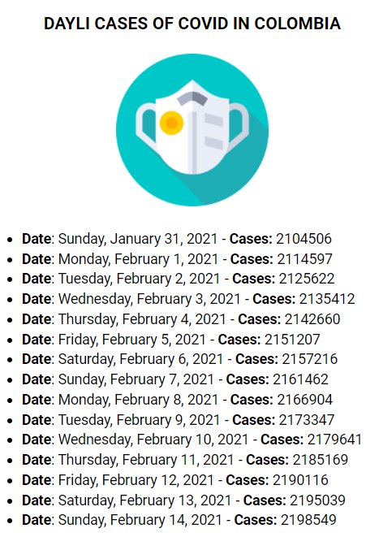

<main>

  <section>
    <article>
      
 
              
      

    </article>
  </section>

   

  <section>
    <article>
      <h1>
         
        helloworld:<a href="https://es.reactjs.org/" rel="external" title="Webpack">react:typescript</a>
      </h1>
      

        React is a JavaScript library for building user interfaces. React has been designed from the start for gradual adoption, and you can use as little or as much React as you need. Whether you want to get a taste of React, add some interactivity to a simple HTML page, or start a complex React-powered app, the links in this section will help you get started. 
      

    </article>
  </section>

   

  <section>
    <article>
      <h2>Preview</h2> 
      
 
              
      

    </article>
  </section>
  
   

  <section>
    <article>
      <h2>Installation</h2> 
      
Using NPM:

      <table>
        <thead>
          <tr>
            <td><strong>Command</strong></td>
            <td><strong>Description</strong></td>
          </tr>
        </thead>
        <tbody>
          <tr>
            <td><code>npm install -S styled-components</code></td>
            <td>Lets you write actual CSS in your JavaScript. This means you can use all the features of CSS you use and love, including (but by far not limited to) media queries, all pseudo-selectors, nesting, etc.</td>
          </tr>
          <tr>
            <td><code>npm install -D react-app-rewired react-app-rewire-alias</code></td>
            <td>Folder aliases</td>
          </tr>    
          <tr>
            <td><code>npm install react-helmet @types/react-helmet</code></td>
            <td>This reusable React component will manage all of your changes to the document head.</td>
          </tr>   
        </tbody>
      </table>      
    </article>
  </section>

   

  <section>
    <article>
      <h2>Core files</h2> 
      <table>
        <thead>
          <tr>
            <td><strong>File</strong></td>
            <td><strong>Description</strong></td>
          </tr>
        </thead>
        <tbody>
          <tr>
            <td><code>./tsconfig.paths</code></td>
            <td>Folder alias list</td>
          </tr>    
          <tr>
            <td><code>./config-overrides</code></td>
            <td>Rewire alias module configuration</td>
          </tr>     
          <tr>
            <td><code>./tsconfig</code></td>
            <td>Typescript configuration</td>
          </tr>  
        </tbody>
      </table> 
    </article>
  </section>

   

  <section>
    <article>
      <h2>Scripts</h2>
      <table>
        <thead>
          <tr>
            <td><strong>Command</strong></td>
            <td><strong>Alias</strong></td>
            <td><strong>Description</strong></td>
          </tr>
        </thead>
        <tbody>
          <tr>
            <td><code>npx create-react-app my-app --template typescript</code></td>
            <td><code>-</code></td>
            <td>Create React App project with TypeScript</code>
          </tr>
          <tr>
            <td><code>npx create-react-app my-app --template cra-template-pwa-typescript</code></td>
            <td><code>-</code></td>
            <td>Create React App project with TypeScript and PWA with workbox</code>
          </tr>
          <tr>
            <td><code>npx create-react-app my-app --template cra-template-pwa</code></td>
            <td><code>-</code></td>
            <td>Create React App project with PWA and workbox</code>
          </tr>
        </tbody>
      </table>
    </article>
  </section>

  

  <section>
    <article>
      

        Icons made by <a href="https://www.flaticon.com/authors/iconixar" title="iconixar">iconixar</a> from <a href="https://www.flaticon.com/" title="Flaticon">www.flaticon.com</a>
         
        <a href='https://www.freepik.com/vectors/technology'>Technology vector created by vectorjuice - www.freepik.com</a>
      
      
    </article>
  </section>

  </main>
